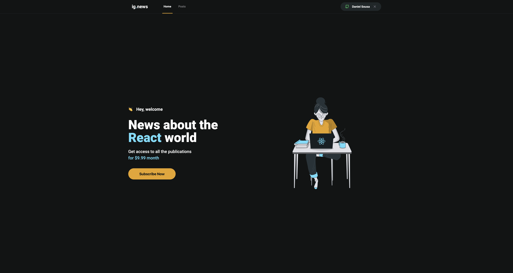
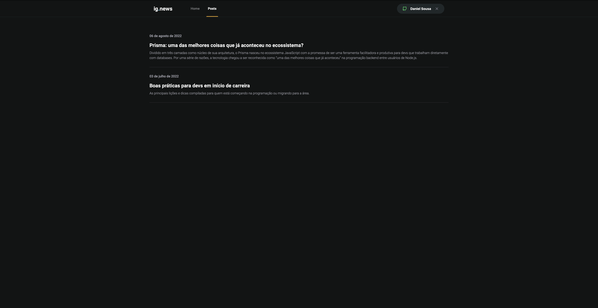
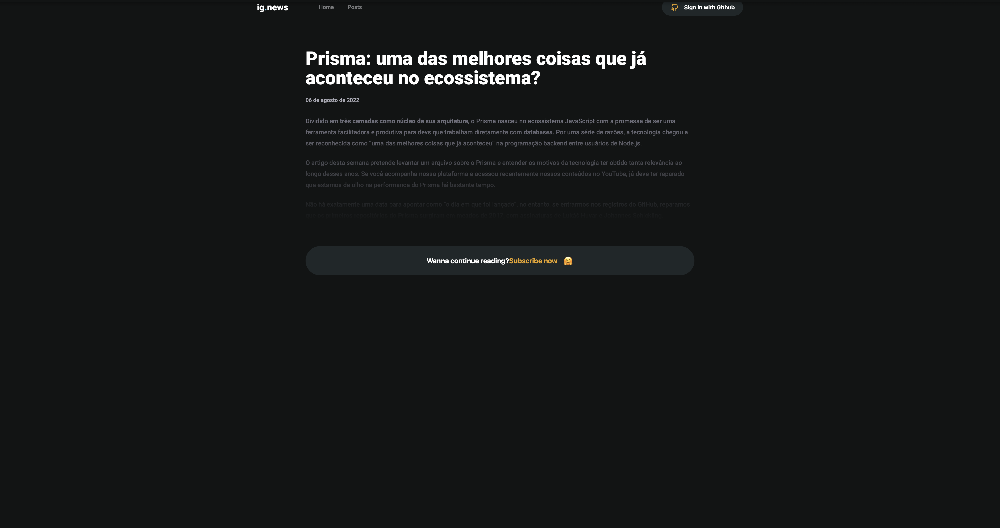
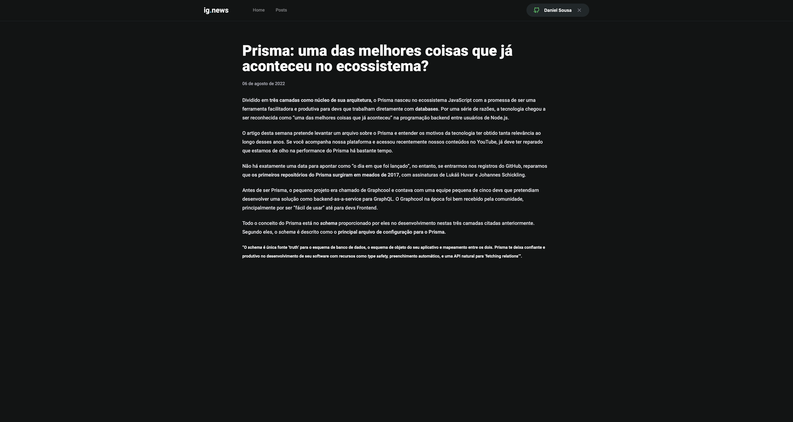

 
 

  	
    
    
    
     
	
	
	
	

<h2 style="font-weight:300">🎨 Layout:</h2>

To see layout created by **Rocketseat** team, click on badge below:

  

<h2 style="font-weight:300">📂 Changes:</h2>

-   Use **React Stitches** instead **Sass**;
-   Use **SVG Sprite** and **Icon** component to access icons in sprite;
-   I build some parts of my layout different **Diego** did on **Ignite** videos;

  

<h2 style="font-weight:300">🖼 Pictures:</h2>

  

<h3 style="font-weight: 300">
🧑🏻‍💻 About Me
</h3>

<a href="https://github.com/TutoDS" alt="TutoDS">

 
 <b>Daniel Sousa @TutoDS</b>
</a>

[facebook]: https://facebook.com/tutods2014
[twitter]: https://twitter.com/tutods
[youtube]: https://youtube.com/tutods2014
[instagram]: https://instagram.com/dsousa_12
[linkedin]: https://www.linkedin.com/in/daniel-sousa-tutods/
[gitlab]: https://gitlab.com/jdaniel.asousa

[][facebook] [][twitter]

[][linkedin] [][instagram]

[][youtube] [][gitlab]

